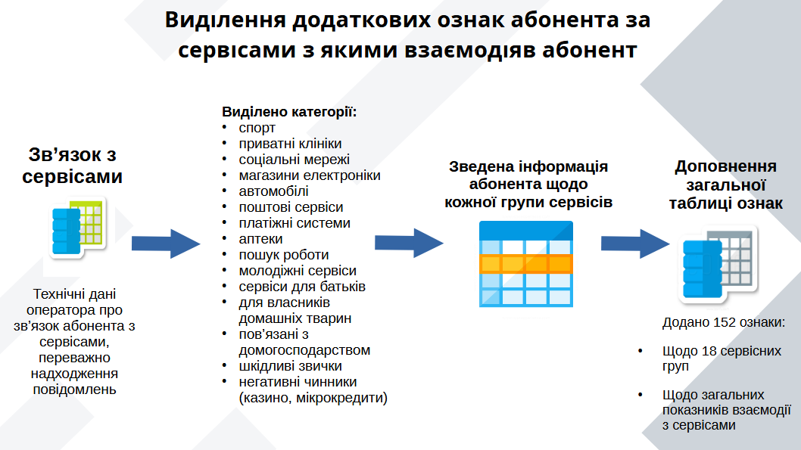
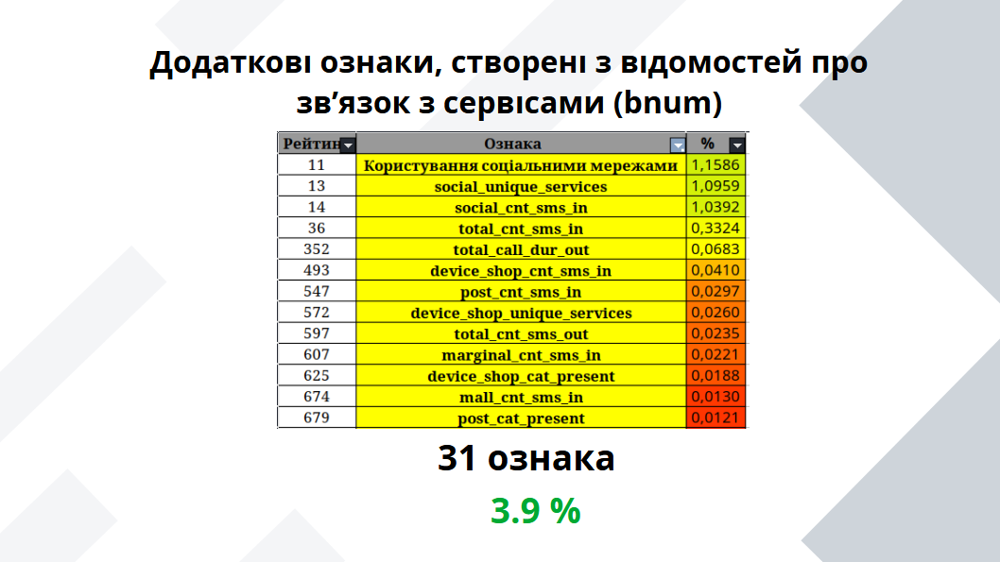

# **Заліковий проєкт курсу Big Data Lab 3 від Vodafone Ukraine**

## Задача класифікації (ML Binary classification model): Модель визначення схильності абонентів мобільного зв'язку до придбання нового пристрою зв'язку у наступному місяці

 

**Бізнес-мета:**

В межах промоакції (продаж телефонів у магазинах Vodafone) необхідно визначити абонентів, схильних до заміни власних телефонів.

**Задача:** 

Визначити клієнтів, які придбають телефон у наступному місяці

**Model target:**

- 1 - Абонент, який змінив свій телефон протягом наступного місяця
- 0 - Абонент продовжив використовувати своїм девайсом протягом наступного місяця

**Evaluation:**

Метрикою якості моделі являються показники ROC-AUC, Precision, Recall, Confusion matrix, f1-score на TestSample

**Baseline test sample - ROC-AUC = 0.62**

## **Схема даних:**

**Train Sample**
- HASH_SCHOOL_DEVICE_MODEL_FE.sas7bdat (Target - розмітка) – абонентська вітрина 
- HASH_SCHOOL_DEVICE_B_NUM.sas7bdat – дані про короткі номери
- HASH_SCHOOL_DEVICE_DPI.sas7bdat – трафік мобільних додатків

**Test Sample**
- HASH_SCHOOL_DEVICE_MODEL_T_FE.sas7bdat(Target - розмітка) – абонентська вітрина 
- HASH_SCHOOL_DEVICE_B_NUM_TEST .sas7bdat – дані про короткі номери
- HASH_SCHOOL_DEVICE_DPI_TEST.sas7bdat – трафік мобільних додатків

**Очікуваним результатом проєкту є:**
1. Jupyter Notebook (з коментованим кодом та прогнозованим результатом Test Sample)
2. Презентація результатів (графіки, таблиці):
    - feature explorer
    - feature encoding,
    - спосіб валідації
    - best model (best algorithm/best metrics)
    - підхід до підбору hyperparameters model
    - features importance
   
# Виконання проєкту

[1. Результати роботи над проєктом](#1-Результати-роботи-над-проєктом)

[2. Вхідні дані та способи автоматизації](#2-Вхідні-дані-та-способи-автоматизації)

[3. Пошук додаткових ознак абонента (feature engineering)](#3-Пошук-додаткових-ознак-абонента-feature-engineering)

[3-1. Використання геоданих розподілу клієнтів (spatial analysis)](#31-Використання-геоданих-розподілу-клієнтів-spatial-analysis)

[4. Ознаки, які позитивно вплинули на роботу моделі (feature importance)](#4-Ознаки,-які-позитивно-вплинули-на-роботу-моделі-feature-importance)

[5. Тренування моделі](#5-Тренування-моделі)

[6. Оцінка результатів роботи моделі (metrics)](#6-Оцінка-результатів-роботи-моделі-metrics)

## 1. Результати роботи над проєктом

### Переваги використання моделей машинного навчання:

- Планування доцільних обсягів рекламних кампаній відповідно потреб ринку
- Прогнозування результатів акцій та майбутнього збуту пристроїв зв’язку
- Виключення дратівливих наслідків для нецільових абонентів
- Отримання кількісних обґрунтувань при прийнятті управлінських рішень
- Зменшення витрат на рекламні кампанії

### Можливі стратегії використання моделей передбачення:
- Визначення абонентів найбільш схильних до придбання або тих, що вже налаштовані на придбанння нового засобу зв’язку
- Покриття більшості абонентів, які проявляють інтерес до купівлі нового пристрою зв’язку 
- Визначення переліку абонентів, які не налаштовані на придбання

## 2. Вхідні дані та способи автоматизації

## 3. Пошук додаткових ознак абонента (feature engineering)

## 3.1. Використання геоданих розподілу клієнтів (spatial analysis)

З наданих до опрацювання даних наявні відомості про локації 97% клієнтів — 204406. 
Більшість спостережень відповідає розташуванню великих міст: Київ, Харків, Суми, Житомир, ділянки узбережжя та деяким прикордонним ділянкам. 

При візуальному порівнянні мап розподілу цільових категорій очевидні відмінності не проявляються. Скупчення абонентів відповідає ділянкам популярності оператора зв'язку, а не розподілу за таргетом.
Запропоновано перевірити закономірності окремих ділянок та регіонів шляхом аналізу даних у сукупності порівнюючи найближчих сусідів. 

### Запропонований механізм виявлення схильності до придбання телефону відповідно до регіону перебування абонента:

Пропонується співставляти перевіряємого абонента із вже відомими абонентами, які є його «найближчими сусідами» по місцевості:

- Враховані сусіди тільки на визначеній відстані (близько 30 км, що відповідає ділянці району або великого міста)

- Відстань сусіда також впливає на його вагу у визначенні загального показника 

- Розрахунок здійснюється тільки за наявності достатніх даних спостереження з ділянки

### Результати опрацювання схильності до придабання нового телефону за географічною ознакою:

На відміну від кількості спостережень, що переважно зосережені у великих містах, схильність до купівлі нових засобів зв’язку більше виражена у прикордонних ділянках. Також у деяких ділянках (зона наближена ТОТ та великі площі, що мають значну відстань до великих міст) — спостерігається зворотння тенденція.

Таким чином сформовано додаткову ознаку щодо кожного абонента (feature), яка визначає схильність притаманного йому регіону до частішої зміни пристрою. 

## 4. Ознаки, які позитивно вплинули на роботу моделі (feature importance)

### Загальний рейтинг ознак:

### Важливість ознак по джерелам даних:

## 5. Тренування моделі

## 6. Оцінка результатів роботи моделі (metrics)

[Переглянути ](#3.-Пошук-додаткових-ознак-абонента-(feature-engineering))
